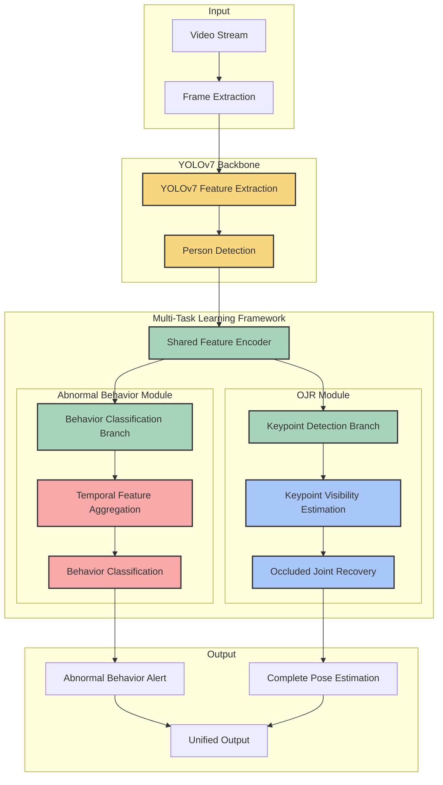

# YOLOv7-based Abnormal Behavior Detection System

This project implements an abnormal behavior detection system using YOLOv7, designed to detect intrusions, threats, robberies, and other abnormal behaviors in smart home environments.

## Overview

The abnormal behavior detection system operates with a unified approach that combines two key capabilities:

1. **Abnormal Behavior Detection**: Detects unusual activities such as intrusions, threats, and robberies
2. **Occluded Joint Recovery (OJR)**: Simultaneously predicts and recovers joint points when they are obscured by objects or other people

Unlike traditional approaches that treat these as separate components, our system integrates them into a single unified model. The system first uses YOLOv7 to detect people in frames, then simultaneously estimates keypoints and classifies behaviors using a multi-task learning framework. This integrated approach improves efficiency, reduces computational overhead, and enhances the system's ability to detect abnormal behaviors even in challenging occlusion scenarios.

### System Architecture



## Methodology Flow

The development of this integrated abnormal behavior detection solution follows these key steps:

1. **Problem Definition**: 
   - Identify the challenges in abnormal behavior detection with occlusions in smart home environments
   - Define requirements for a unified system that can simultaneously detect abnormal behaviors and recover occluded joints

2. **Data Collection and Preparation**:
   - Gather datasets containing normal and abnormal behavior sequences with various occlusion scenarios
   - Preprocess and annotate data for multi-task learning
   - Implement data augmentation techniques to improve model robustness to occlusions
   - **Ensure dataset balance between normal and abnormal behavior examples** to prevent biased training

3. **Unified Model Architecture Design**:
   - Integrate YOLOv7 as the backbone for accurate human detection
   - Design a multi-task learning framework that shares features between behavior detection and joint recovery tasks
   - Implement task-specific branches with appropriate loss functions for each task
   - Create attention mechanisms to focus on potentially abnormal behaviors and occluded regions

4. **End-to-End Training Process**:
   - Develop a balanced loss function that addresses both behavior detection and joint recovery objectives
   - Implement a curriculum learning strategy that gradually increases the difficulty of occlusion scenarios
   - Train the unified model end-to-end to optimize both tasks simultaneously
   - **Monitor training metrics to ensure the model is learning to distinguish between classes**

5. **Evaluation and Optimization**:
   - Evaluate system performance on test datasets with various occlusion levels
   - Analyze failure cases and optimize model parameters for both tasks
   - Implement real-time processing optimizations for edge deployment

6. **Deployment**:
   - Package the unified solution for easy deployment in smart home environments
   - Implement an efficient inference pipeline for video and camera inputs

This unified methodology ensures a comprehensive and efficient approach to the abnormal behavior detection problem, addressing the challenges of occlusion without the computational overhead of separate models.

## Project Structure

```
yolov7-abnormal-behavior-detection/
├── config/
│   └── config.yaml           # Configuration parameters for training and inference
├── data/
│   ├── train/                # Training data
│   ├── val/                  # Validation data
│   ├── test/                 # Test data
│   ├── train_list.txt        # List of training samples
│   ├── val_list.txt          # List of validation samples
│   └── test_list.txt         # List of test samples
├── models/
│   ├── yolov7/               # YOLOv7 implementation
│   ├── abnormal.py           # Abnormal behavior detection model
│   ├── ojr.py                # OJR model implementation
│   └── model_utils.py        # Shared utilities for models
├── utils/
│   ├── data_utils.py         # Dataset and dataloader utilities
│   ├── visual_utils.py       # Visualization tools
│   ├── losses.py             # Custom loss functions
│   └── metrics.py            # Evaluation metrics
├── scripts/
│   ├── prepare_data.py       # Data preparation script
│   ├── filter_bad_videos.py  # Script to filter problematic videos
│   └── convert_dataset.py    # Script to convert datasets to project format
├── weights/
│   ├── yolov7.pt             # YOLOv7 pre-trained weights
│   ├── abnormal_state_dict.pt # Abnormal behavior model weights
│   └── ojr_state_dict.pt     # OJR model weights
├── logs/                     # Training logs organized by date and model type
├── outputs/                  # Inference outputs and visualizations
├── docs/                     # Documentation
├── train.py                  # Main training script
├── evaluate.py               # Evaluation script
├── detect_abnormal.py        # Abnormal behavior detection inference script
├── combine_models.py         # Script to combine models into a unified model
├── requirements.txt          # Project dependencies
└── README.md                 # Project information
```

## Installation

### Prerequisites

- Python 3.8+
- PyTorch 1.8+
- CUDA (recommended for faster training and inference)

### Setup

1. Clone the repository:
   ```bash
   git clone https://github.com/hoangnv170752/yolov7-abnormal-behavior-detection.git
   cd yolov7-abnormal-behavior-detection
   ```

2. Install dependencies:
   ```bash
   pip install -r requirements.txt
   ```

3. Download YOLOv7 weights and set up the project structure:
   ```bash
   python scripts/download_weights.py
   ```

## Dataset Preparation

### UBnormal Dataset

This project uses the UBnormal dataset, a supervised open-set benchmark for video anomaly detection. UBnormal features:

- Multiple virtual scenes specifically designed for video anomaly detection
- Abnormal events annotated at the pixel level at training time, enabling fully-supervised learning methods
- Disjoint sets of anomaly types in training and test collections to preserve open-set formulation

The UBnormal dataset can be downloaded from [here](https://drive.google.com/file/d/1KbfdyasribAMbbKoBU1iywAhtoAt9QI0/view?usp=sharing).

### Complete Data Preparation Workflow

Follow these steps to properly prepare your data for training:

1. **Organize Raw Data**:
   ```bash
   python scripts/prepare_data.py --dataset abnormal --raw-data /path/to/dataset --output-dir data
   ```
   This organizes your raw dataset into the project's expected structure.

2. **Create Balanced Dataset**:
   ```bash
   python scripts/create_balanced_dataset.py
   ```
   This script:
   - Analyzes your dataset structure
   - Identifies normal and abnormal behavior segments based on annotations
   - Creates balanced training, validation, and test lists with both normal and abnormal examples

3. **Filter Problematic Videos**:
   ```bash
   python scripts/filter_bad_videos.py
   ```
   This critical step:
   - Verifies each video in your balanced dataset
   - Identifies videos that cannot be properly loaded or have frame extraction issues
   - Creates filtered lists excluding problematic videos

4. **Update Configuration**:
   Update your `config.yaml` file to use the filtered lists:
   ```yaml
   data:
     train_list: data/train_list_filtered.txt
     val_list: data/val_list_filtered.txt
     test_list: data/test_list_filtered.txt
   ```

## Training

### Preparing for Training

Before starting the training process, ensure that:
1. You have prepared your dataset following the steps in the Dataset Preparation section
2. The configuration file (`config/config.yaml`) is set up with your desired parameters
3. The weights directory exists for saving model checkpoints

### Training the Abnormal Behavior Detection Model

To train the abnormal behavior detection model:

```bash
python train.py --train-abnormal --gpu 0
```

Parameters:
- `--train-abnormal`: Train the abnormal behavior detection model
- `--gpu`: GPU ID to use (use -1 for CPU)

The training process will:
1. Load the balanced and filtered dataset
2. Initialize the model with the YOLOv7 backbone
3. Train for the specified number of epochs (set in `config.yaml`)
4. Save checkpoints when validation loss or F1 score improves
5. Output training and validation metrics after each epoch

### Training the OJR Model

To train the OJR (Occluded Joints Recovery) model:

```bash
python train.py --train-ojr --gpu 0
```

Parameters:
- `--train-ojr`: Train the OJR model
- `--gpu`: GPU ID to use (use -1 for CPU)

The OJR model training requires a pre-trained abnormal behavior detection model.

### Combining Models

After training both models separately, you can combine them into a unified model:

```bash
python combine_models.py --abnormal-weights weights/abnormal_state_dict.pt --ojr-weights weights/ojr_state_dict.pt
```

This creates a unified model that handles both abnormal behavior detection and occluded joint recovery.

## Evaluation

Evaluate the trained model:

```bash
python evaluate.py --weights weights/unified_model.pt --dataset data/test_list_filtered.txt
```

## Inference

Run inference on a video:

```bash
python detect_abnormal.py --weights weights/unified_model.pt --source path/to/video.mp4
```

## License

This project is licensed under the MIT License - see the LICENSE file for details.

## Acknowledgments

- YOLOv7 implementation by [WongKinYiu](https://github.com/WongKinYiu/yolov7)
- Abnormal behavior datasets: UCF-Crime, ShanghaiTech, etc.
